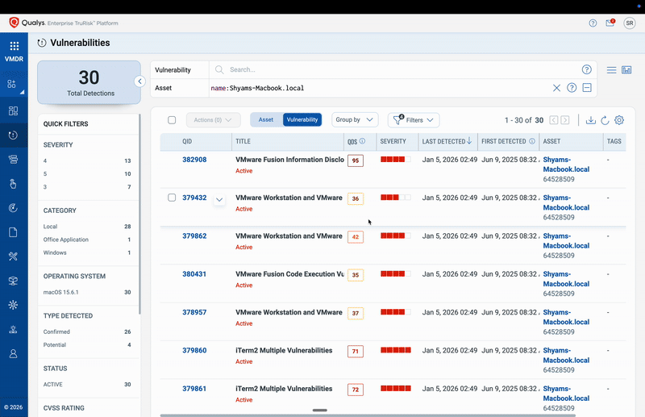

# Qualys Column Resizer

A Chrome browser extension that adds draggable column resizers and visibility controls to Qualys VMDR and GAV/CSAM tables.

---

## Features

- **Drag to Resize Columns** - Adjust column widths by dragging resize handles
- **Show/Hide Columns** - Toggle column visibility via settings menu
- **Persistent Settings** - Your preferences are saved automatically
- **Global Support** - Works on all Qualys public platforms

---

## Supported Pages

Works on:
- **VMDR** - Vulnerabilities view
- **Global AssetView (GAV) / CyberSecurity Asset Management (CSAM)** - Inventory, Responses, Rules, Reports

---

## Download & Installation

### Download Latest Version

**[Download v1.2 (ZIP)](https://raw.githubusercontent.com/sr-87/qualys/main/Column%20Resizer/chrome/qualys-column-resizer-v1.2.zip)**

### Installation Steps

1. **Download** the ZIP file and extract it
2. Open Chrome and go to `chrome://extensions/`
3. Enable **"Developer mode"** (toggle in top-right)
4. Click **"Load unpacked"**
5. Select the extracted `qualys-column-resizer-v1.2` folder

Full installation instructions are included in the ZIP file's README.

---

## Supported Qualys Platforms

Works on all global Qualys platforms:
- United States (qualys.com)
- Europe (qualys.eu)
- United Kingdom (qualys.co.uk)
- India (qualys.in)
- Canada (qualys.ca)
- Australia (qualys.com.au)
- Italy (qualys.it)
- UAE (qualys.ae)
- Saudi Arabia (qualysksa.com)

---

## Privacy & Security

- Only runs on Qualys domains
- No data sent to external servers
- Settings stored locally in browser
- No tracking or analytics
- Open source - review the code

---

## Version History

**v1.2** (Current)
- Added support for all global Qualys platforms
- Fixed first-load activation issues
- Improved column resize handle visibility
- Added column show/hide functionality
- Better handling of narrow/checkbox columns

---

## Support

If you encounter issues or have questions, please [open an Issue](../../issues).

---

## License

This is an unofficial browser extension and is not affiliated with or supported by Qualys, Inc.
